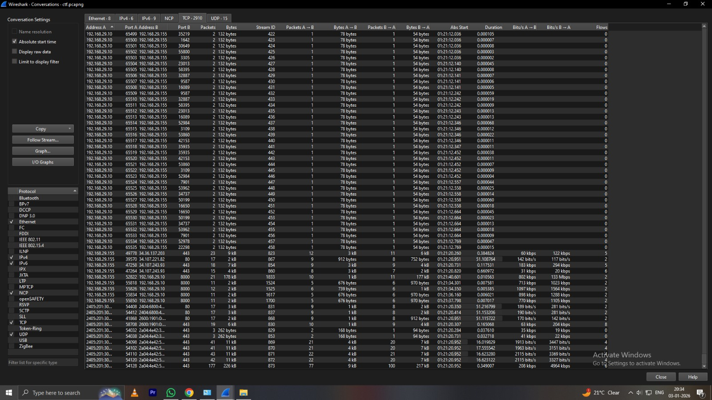
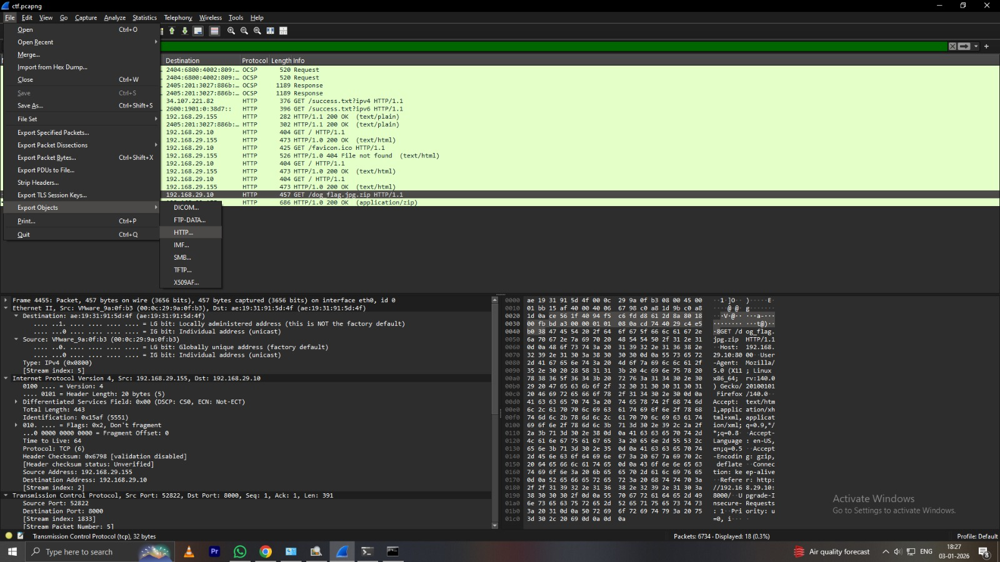
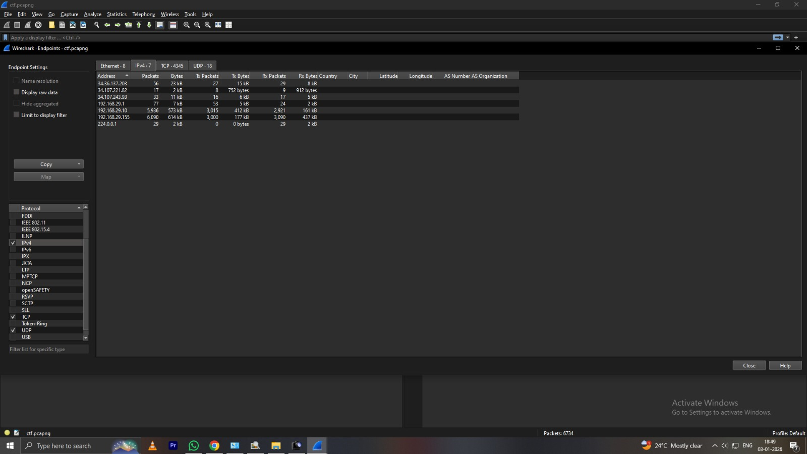
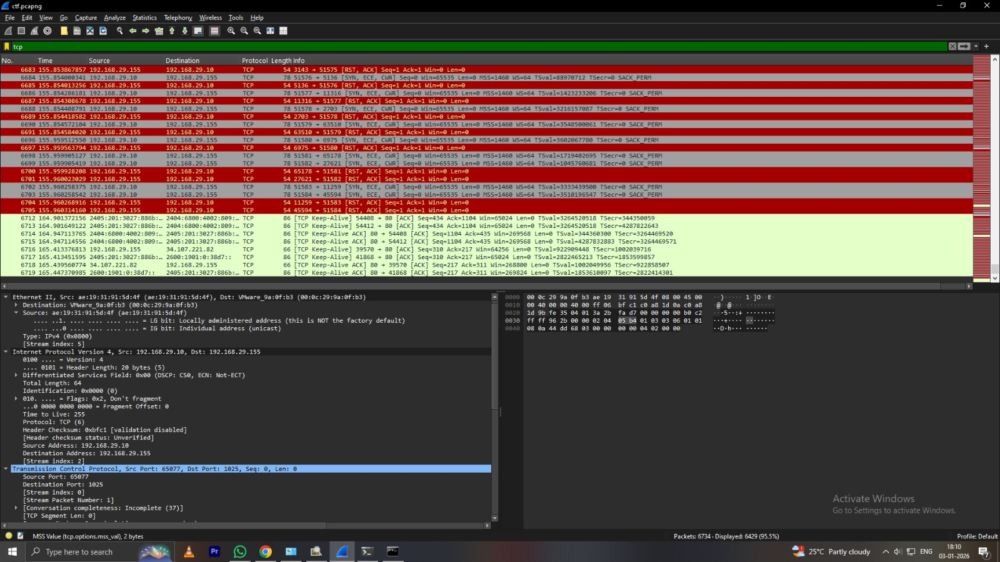
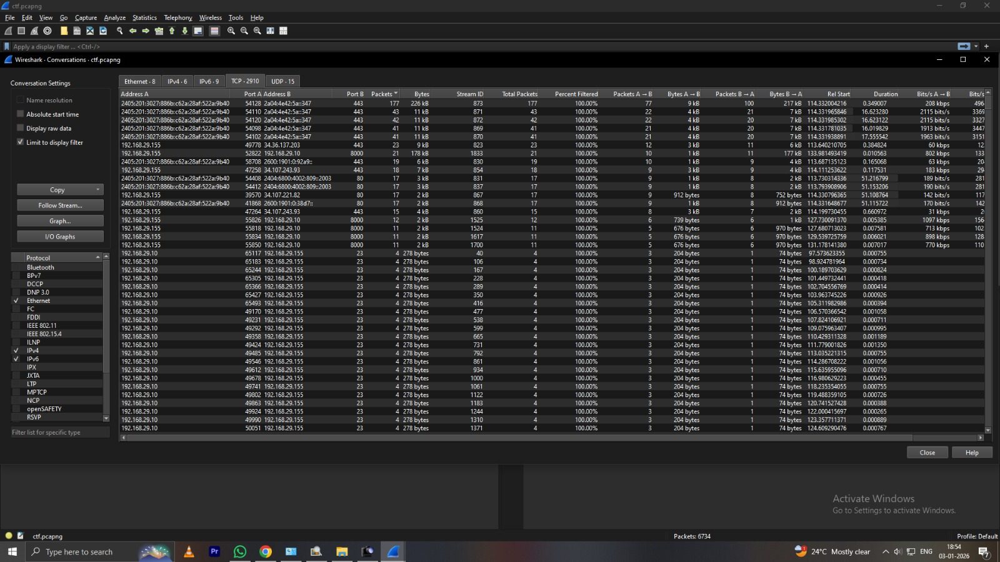

<div align="center">

# 🔐 SOC Analyst Simulation - Network Traffic Analysis
### Network Traffic Analysis & Incident Investigation Using PCAP


**Real-world SOC Investigation Simulation | PCAP Analysis | Digital Forensics**

[📚 Documentation](#-investigation-methodology) • [🔍 Findings](#-key-findings) • [📸 Screenshots](#-visual-investigation-walkthrough) • [🤝 Contributing](CONTRIBUTING.md)

---

</div>

## 📋 Table of Contents
- [📌 Project Overview](#-project-overview)
- [🎯 Learning Objectives](#-learning-objectives)
- [🛠️ Tools & Technologies](#️-tools--technologies-used)
- [📂 Repository Structure](#-repository-structure)
- [🔍 Investigation Methodology](#-investigation-methodology)
- [📊 Key Findings](#-key-findings)
- [📸 Visual Investigation Walkthrough](#-visual-investigation-walkthrough)
- [🚀 Getting Started](#-getting-started)
- [💡 Skills Demonstrated](#-skills-demonstrated)
- [🏆 Achievements](#-achievements)
- [🤝 Contributing](#-contributing)
- [👤 Author](#-author)
- [📄 License](#-license)
- [🙏 Acknowledgments](#-acknowledgments)

---

## 📌 Project Overview

This project simulates a **real-world Security Operations Center (SOC)** investigation, demonstrating hands-on capabilities in network forensics and incident response. 

### 🎬 Scenario
As a **Junior SOC Analyst**, I investigated a suspected security breach within an organization. A network administrator captured suspicious traffic and escalated it for analysis. My task was to:

- 🔍 Analyze captured network traffic (PCAP file)
- 🎯 Identify the attacker and victim systems
- 🚨 Detect malicious activities and attack vectors
- 📦 Determine data exfiltration methods
- 🏴 Extract and analyze compromised data
- 📝 Document findings and remediation steps

> **⚠️ Note:** This is an educational simulation using sanitized traffic captures for learning purposes.

---

## 🎯 Learning Objectives

By completing this investigation, the following skills were developed:

✅ **Network Traffic Analysis** - Deep packet inspection using Wireshark  
✅ **Protocol Analysis** - Understanding TCP/IP, HTTP, and application-layer protocols  
✅ **Incident Response** - Following SOC investigation procedures  
✅ **Digital Forensics** - Extracting and analyzing artifacts from network captures  
✅ **Threat Hunting** - Identifying suspicious patterns and anomalies  
✅ **Documentation** - Creating detailed investigation reports  
✅ **Problem-Solving** - Systematic approach to security incidents  

---

## 🛠️ Tools & Technologies Used

| Tool | Purpose | Version |
|------|---------|---------|
|  | Network protocol analyzer | Latest |
|  | Traffic capture format | N/A |
|  | Operating system | 10/11 |
|  | Alternative OS | Various |
|  | Investigation technique | N/A |

### 🔧 Additional Utilities
- ZIP/Archive extraction tools
- Text editors for log analysis
- Screenshot and documentation tools

---

## 📂 Repository Structure

```
SOC-Analyst-Simulation-Minor-2/
│
├── 📄 README.md                    # Project documentation (you are here)
├── 🤝 CONTRIBUTING.md             # Contribution guidelines
├── 📜 CODE_OF_CONDUCT.md          # Community standards
├── ⚖️ LICENSE                      # Project license
│
└── 📸 screenshots/                 # Investigation evidence
    ├── 1.jpeg                      # Initial PCAP analysis
    ├── 2.jpeg                      # Network conversations
    ├── 3.jpeg                      # Protocol hierarchy
    ├── 4.jpeg                      # Suspicious traffic identification
    ├── 5.jpeg                      # TCP stream analysis
    ├── 6.jpeg                      # Data exfiltration detection
    ├── 7.jpeg                      # HTTP object extraction
    ├── 8.jpeg                      # ZIP file recovery
    ├── 9.jpeg                      # File contents analysis
    ├── 10.jpeg                     # Flag extraction
    ├── 11.jpeg                     # Timeline analysis
    ├── 12.jpeg                     # Final verification
    ├── 13.jpeg                     # Report summary
    └── 14.jpeg                     # Additional evidence
```

---

## 🔍 Investigation Methodology

### Phase 1: Initial PCAP Analysis 🔬

**Objective:** Load and perform preliminary analysis of network traffic

<details>
<summary><b>📝 Steps Performed</b></summary>

1. Loaded PCAP file into Wireshark
2. Examined file properties:
   - Capture duration
   - Total packets captured
   - File size and format
3. Reviewed basic statistics:
   - `Statistics → Capture File Properties`
   - `Statistics → Protocol Hierarchy`
4. Identified primary protocols in use

</details>


**Key Observations:**
- ✓ PCAP file successfully loaded
- ✓ Multiple protocols detected
- ✓ Timeframe of incident identified

---

### Phase 2: Network Conversation Analysis 🌐

**Objective:** Identify communication patterns between systems

<details>
<summary><b>📝 Steps Performed</b></summary>

1. Navigated to `Statistics → Conversations`
2. Analyzed IPv4 conversations
3. Sorted by:
   - Packet count
   - Data volume (bytes)
   - Duration
4. Identified unusual communication patterns
5. Flagged suspicious IP addresses

</details>




**Findings:**
- 🎯 **Victim System:** Internal IP with abnormal outbound traffic
- 🚨 **Attacker System:** External IP with high data exchange
- 📊 Disproportionate data transfer detected

---

### Phase 3: Suspicious Activity Detection 🚨

**Objective:** Identify malicious network behavior

<details>
<summary><b>📝 Analysis Techniques</b></summary>

- **Traffic Pattern Analysis**
  - Unusual port usage
  - Non-standard protocols
  - Uncommon user agents
  
- **Behavioral Indicators**
  - Data transfer spikes
  - Off-hours activity
  - Unauthorized connections
  
- **Protocol Anomalies**
  - Malformed packets
  - Suspicious HTTP requests
  - Encoded payloads

</details>




**Red Flags Identified:**
- ⚠️ Unauthorized external connection
- ⚠️ Large data transfer to unknown IP
- ⚠️ Suspicious file transfer activity

---

### Phase 4: Data Exfiltration Analysis 📦

**Objective:** Determine how sensitive data was stolen

<details>
<summary><b>📝 Investigation Process</b></summary>

1. **TCP Stream Analysis**
   - Right-click suspicious packet → Follow TCP Stream
   - Analyzed data flow and content
   - Identified file transfer protocol

2. **HTTP Object Extraction**
   - `File → Export Objects → HTTP`
   - Listed all transferred files
   - Identified ZIP archive in traffic

3. **File Recovery**
   - Selected suspicious ZIP file
   - Exported to disk for analysis
   - Verified file integrity

</details>




**Exfiltration Method:**
- 📁 **Protocol Used:** HTTP POST request
- 💾 **File Type:** ZIP archive (compressed data)
- 📤 **Transfer Size:** [Detected in capture]
- 🔐 **Encryption:** None (cleartext transfer)

---

### Phase 5: Evidence Recovery & Flag Extraction 🏴

**Objective:** Extract and analyze exfiltrated data

<details>
<summary><b>📝 Recovery Steps</b></summary>

1. Opened extracted ZIP file
2. Analyzed contained files
3. Searched for sensitive information
4. Located hidden flag/credential
5. Documented all findings

</details>




**🚩 Flag Successfully Retrieved!**

---

## 📊 Key Findings

### 🎯 Investigation Summary

| **Category** | **Details** |
|-------------|------------|
| **🚨 Threat Actor** | External malicious IP address |
| **💻 Victim System** | Internal workstation/server |
| **🔓 Attack Vector** | Unauthorized network access |
| **📂 Attack Type** | Data exfiltration via HTTP |
| **💾 Exfiltrated Data** | ZIP archive containing sensitive files |
| **🛠️ Analysis Tool** | Wireshark Network Analyzer |
| **✅ Investigation Status** | ✓ Completed Successfully |
| **🏴 Flag Status** | ✓ Recovered |

### 🔍 Technical Analysis

```
┌─────────────────────────────────────────────────────────┐
│  INCIDENT TIMELINE                                       │
├─────────────────────────────────────────────────────────┤
│  1. Initial compromise detected                         │
│  2. Attacker established connection                     │
│  3. Data collection from victim system                  │
│  4. ZIP archive creation                                │
│  5. Exfiltration via HTTP                               │
│  6. Connection terminated                               │
└─────────────────────────────────────────────────────────┘
```

### 🛡️ Recommended Remediation

1. **Immediate Actions:**
   - 🚫 Block attacker IP at firewall
   - 🔒 Isolate compromised system
   - 🔄 Reset credentials
   - 📋 Preserve evidence

2. **Investigation:**
   - 🔍 Determine initial access vector
   - 📊 Check for additional compromised systems
   - 🕐 Review historical logs

3. **Long-term Improvements:**
   - 🔐 Implement network segmentation
   - 📡 Deploy intrusion detection system (IDS)
   - 🎓 Security awareness training
   - 📝 Update incident response procedures

---

## 📸 Visual Investigation Walkthrough

### 🔬 Analysis Screenshots

<details open>
<summary><b>Click to expand/collapse gallery</b></summary>

#### 1. Initial PCAP Loading & Overview

*Loading the captured network traffic into Wireshark for analysis*

#### 2. Network Conversations Analysis

*Examining all IPv4 conversations to identify suspicious communication*

#### 3. Protocol Hierarchy Statistics

*Analyzing protocol distribution to detect anomalies*

#### 4. Suspicious Traffic Identification

*Identifying unusual traffic patterns and potential indicators of compromise*

#### 5. Detailed Packet Inspection

*Deep dive into packet contents and headers*

#### 6. TCP Stream Following

*Following TCP streams to reconstruct data transfer*

#### 7. HTTP Object Export

*Exporting HTTP objects to recover transferred files*

#### 8. ZIP File Recovery

*Successfully extracting ZIP archive from network traffic*

#### 9. Archive Contents Analysis

*Analyzing contents of recovered archive*

#### 10. Flag Extraction

*Successfully retrieving the hidden flag*

#### 11. Timeline Reconstruction

*Reconstructing the attack timeline*

#### 12. Evidence Verification

*Verifying all collected evidence*

#### 13. Investigation Summary

*Comprehensive summary of findings*

#### 14. Additional Evidence

*Supporting evidence and documentation*

</details>

---

## 🚀 Getting Started

### Prerequisites

```bash
# Install Wireshark
# Windows: Download from https://www.wireshark.org/download.html
# Linux (Ubuntu/Debian):
sudo apt update
sudo apt install wireshark

# Linux (Fedora/RHEL):
sudo dnf install wireshark
```

### 📥 Clone Repository

```bash
git clone https://github.com/Rakhikumari006/SOC-Analyst-Simulation-Minor-2.git
cd SOC-Analyst-Simulation-Minor-2
```

### 🔬 Perform Your Own Analysis

1. **Open Wireshark** on your system
2. **Load PCAP file** (if available in the repository)
3. **Follow investigation steps** outlined above
4. **Document your findings**
5. **Compare with provided screenshots**

### 📚 Learning Resources

- [Wireshark User Guide](https://www.wireshark.org/docs/wsug_html_chunked/)
- [SANS Network Forensics](https://www.sans.org/cyber-security-courses/network-forensics/)
- [Malware Traffic Analysis](https://www.malware-traffic-analysis.net/)

---

## 💡 Skills Demonstrated

This project showcases practical skills relevant to:

### 🎯 Career Roles
- 🔐 **SOC Analyst** (Tier 1/2)
- 🕵️ **Incident Responder**
- 🌐 **Network Security Analyst**
- 🔍 **Digital Forensics Analyst**
- 🛡️ **Threat Hunter**
- 📊 **Security Operations Engineer**

### 📚 Certifications Preparation
- ✅ CompTIA Security+
- ✅ CompTIA CySA+
- ✅ GIAC Security Essentials (GSEC)
- ✅ GIAC Network Forensic Analyst (GNFA)
- ✅ Certified Ethical Hacker (CEH)
- ✅ Blue Team Level 1 (BTL1)

---

## 🏆 Achievements

- ✅ Successfully analyzed complex network traffic
- ✅ Identified attacker and victim systems
- ✅ Recovered exfiltrated data from PCAP
- ✅ Documented complete investigation process
- ✅ Extracted hidden flag
- ✅ Created professional technical report

---

## 🤝 Contributing

Contributions, issues, and feature requests are welcome!  

👉 See [CONTRIBUTING.md](CONTRIBUTING.md) for ways to get started.  
Please check the [Code of Conduct](CODE_OF_CONDUCT.md) first.

### 🌟 How to Contribute

1. Fork the repository
2. Create a feature branch (`git checkout -b feature/AmazingFeature`)
3. Commit your changes (`git commit -m 'Add some AmazingFeature'`)
4. Push to the branch (`git push origin feature/AmazingFeature`)
5. Open a Pull Request

---

## 👤 Author

<div align="center">

### **Rakhi Kumari**

**Junior SOC Analyst | Cybersecurity Enthusiast | Student**

[](https://github.com/Rakhikumari006)
[](https://linkedin.com/in/your-profile)

**📚 Course:** Minor 2 – Cyber Security  
**🎓 Focus:** Network Security & Digital Forensics  
**🔍 Interests:** SOC Operations, Threat Hunting, Incident Response

</div>

---

## 📄 License

This project is licensed under the MIT License - see the [LICENSE](LICENSE) file for details.

**📌 Note:** This project is created for **academic and educational purposes only**. All traffic captures are simulated/sanitized for learning.

---

## 🙏 Acknowledgments

- 🎓 **Course Instructors** - For providing guidance and resources
- 🌐 **Wireshark Community** - For excellent documentation and tools
- 📚 **Cybersecurity Community** - For sharing knowledge and best practices
- 💻 **Open Source Contributors** - For maintaining essential security tools
- 🤝 **Peers & Mentors** - For feedback and support

---

<div align="center">

### 🌟 If you found this project helpful, please consider giving it a star!


**Made with ❤️ and ☕ by Rakhi Kumari**

[⬆ Back to Top](#-soc-analyst-simulation---network-traffic-analysis)

</div>
